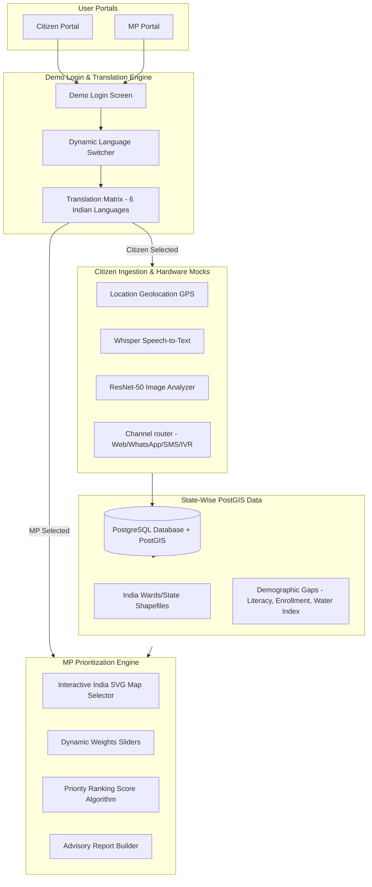

# AI-Powered Citizen Feedback Platform for Development Planning

Welcome to the **People's Priority** platform documentation. This system is designed to help Members of Parliament (MPs) and local administrators aggregate citizen feedback (voice, images, text) and combine it with baseline demographic statistics to prioritize local development projects.

---

## 1. System Architecture

Below is the end-to-end architecture flow, catering differently to **Citizens** (ingestion, permissions, translation) and **MPs** (state dashboards, prioritized recommendations):



---

## 2. Persona-Split Dashboard Layouts

To ensure the best user experience and separate concerns, the platform is divided into two distinct portals:

### A. Citizen Portal
Designed for simple, friction-free submission of developmental feedback.
* **Location Sharing**: Simulated GPS lock using browser geolocation guidelines. Location checks sort complaints state-wise.
* **Microphone Start/Stop**: Clicking starts simulated voice note recording. Double-tapping stops recording and transcribes regional audio transcripts into native text.
* **Camera Upload**: Prompts for file/camera permissions and uploads simulated infrastructure fault captures.
* **Submission History**: Local table displaying processed suggestions and verification tags.

### B. MP Dashboard
Focuses on constituency insights, analytical dashboards, and prioritization sliders.
* **Interactive India SVG Map**: Select active states (Tamil Nadu, Karnataka, Maharashtra, Uttar Pradesh, West Bengal) to immediately filter KPIs, public demands, and recommended projects.
* **AI Parsing Sandbox**: Real-time playground to test Bhashini translation, NER tags extraction, topic confidence scores, and urgency sentiment index.
* **Project Recommendations Table**: Adjust sliders to balance demands against budgets.

---

## 3. Dynamic Multilingual Translation Matrix

A dynamic dictionary maps all interface headers, labels, placeholders, and buttons into six major languages:
1. **English (en)**
2. **Hindi (hi - हिन्दी)**
3. **Tamil (ta - தமிழ்)**
4. **Telugu (te - తెలుగు)**
5. **Kannada (kn - ಕನ್ನಡ)**
6. **Bengali (bn - বাংলা)**

When a language is selected, a DOM translation script updates all elements with a `data-i18n` attribute. Post-login language switcher dropdowns allow real-time changes without logging out.

---

## 4. State-Wise PostGIS Mapping

Geospatial routing is handled by PostGIS spatial queries. When a citizen submits feedback, their coordinates are intersected with state boundary polygons:

```sql
-- Find matching state for a citizen location point
SELECT state_name, state_id 
FROM india_states 
WHERE ST_Contains(geom, ST_SetSRID(ST_Point(80.2707, 13.0827), 4326));
```

This routes complaints to the respective state, updating that state's MP dashboard statistics.

---

## 5. Priorities Scoring Algorithm

The Recommendation Engine ranks public works using:

$$\text{Priority Score} = w_1 \cdot \text{Demand} + w_2 \cdot \text{Baseline Gap} + w_3 \cdot \text{Population Impact} - w_4 \cdot \text{Budget Cost}$$

Where:
* **Demand**: Normalized state feedback requests matching the project theme.
* **Baseline Gap**: Regional demographic deficit (e.g., $100 - \text{Literacy Rate}$).
* **Population Impact**: State population density normalized to max density.
* **Budget Cost**: Cost category deduction value.
* **Weights ($w_1, w_2, w_3, w_4$)**: Tunable sliders summing to 100%.

---
